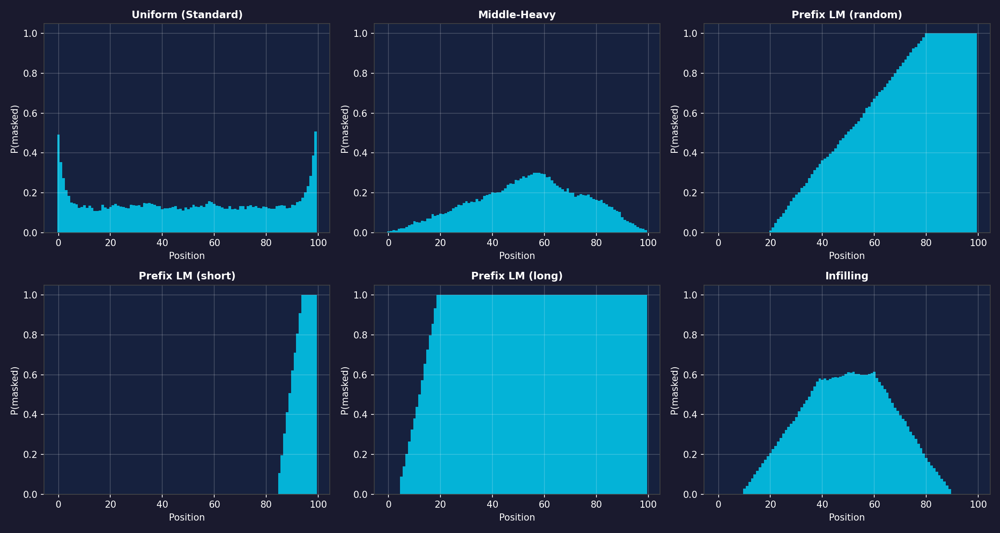
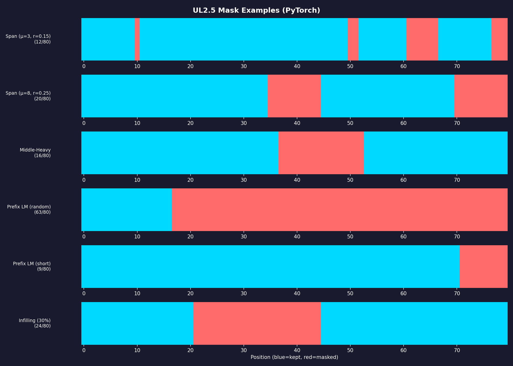
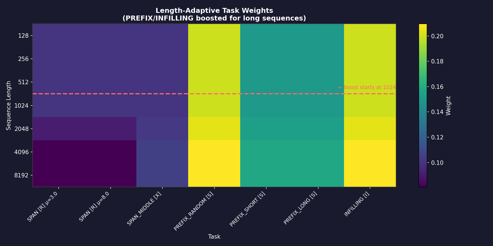
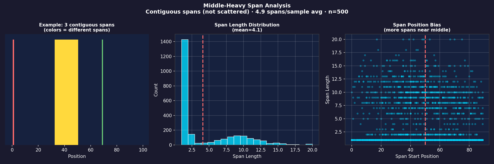
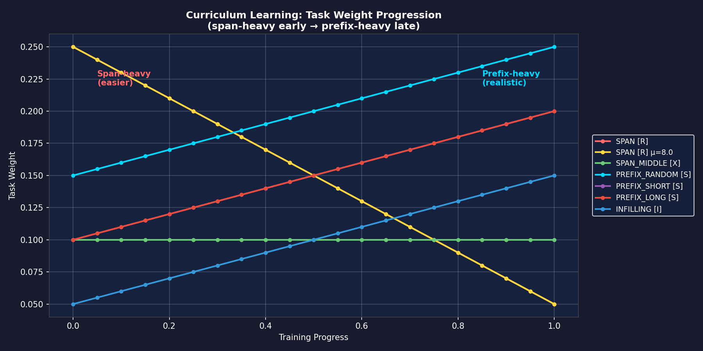
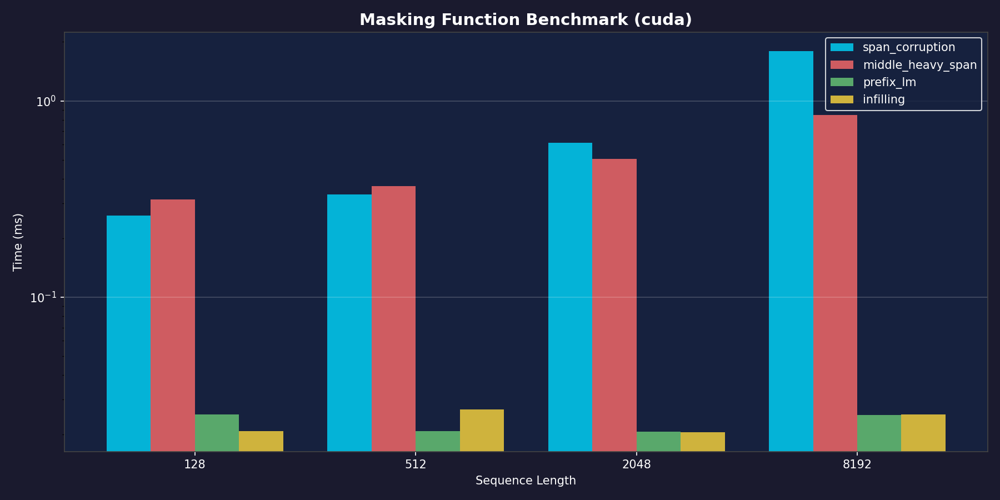

# UL2.5 Data Collator

Training-ready data collation for encoder-decoder models (T5, FLAN, etc.), implementing and improving on the [UL2](https://arxiv.org/abs/2205.05131) mixture-of-denoisers training paradigm.

## Features

- **Multiple denoising objectives**: Span corruption, prefix LM, infilling
- **GPU-optimized**: Batch sampling, device-specific caching, minimal CPU-GPU sync
- **Validated configs**: Pydantic-based checks for weights and ranges
- **HuggingFace compatible**: Works with `Trainer` and `DataLoader`
- **Curriculum learning**: Gradually shift denoiser mixture during training
- **Length-adaptive sampling**: Boost long-context tasks for long sequences
- **Span boundary snapping**: Optional alignment of span starts to word boundaries (CPU only, off by default)
- **Flash Attention support**: Optional unpadding for FA2 varlen kernels with `cu_seqlens` metadata
- **Two implementations**: HF-integrated (`collator_hf.py`) or pure PyTorch (`collator_torch.py`)

---

- [UL2.5 Data Collator](#ul25-data-collator)
  - [Features](#features)
  - [Installation](#installation)
  - [Quick Start](#quick-start)
  - [Configuration Presets](#configuration-presets)
  - [UL2 Mode Token Semantics](#ul2-mode-token-semantics)
  - [Context Length Guidance](#context-length-guidance)
  - [Usage with HuggingFace Trainer](#usage-with-huggingface-trainer)
  - [Usage with DataLoader](#usage-with-dataloader)
  - [Curriculum Learning](#curriculum-learning)
  - [Custom Configuration](#custom-configuration)
  - [Denoising Tasks](#denoising-tasks)
  - [API Reference](#api-reference)
  - [Flash Attention Integration](#flash-attention-integration)
  - [Performance Tips](#performance-tips)
  - [Benchmarks](#benchmarks)
  - [Visualizations](#visualizations)
  - [References](#references)

---

## Installation

```bash
pip install "git+https://github.com/pszemraj/UL2_5.git"
```

Or clone and install in editable mode:

```bash
git clone <repo-url>
cd UL2_5
pip install -e ".[dev]"
```

## Quick Start

```python
from transformers import AutoTokenizer, T5ForConditionalGeneration
from UL2_5 import UL25DataCollator, UL25Config

# Load model and tokenizer
tokenizer = AutoTokenizer.from_pretrained("google-t5/t5-base")
model = T5ForConditionalGeneration.from_pretrained("google-t5/t5-base")

# Add UL2 task prefixes (optional but recommended)
tokenizer.add_special_tokens({
    "additional_special_tokens": ["[R]", "[S]", "[X]", "[I]"]
})
model.resize_token_embeddings(len(tokenizer))

# Create collator
collator = UL25DataCollator(
    tokenizer=tokenizer,
    config=UL25Config.recommended(),
    max_length=512,
    max_labels_length=128,
)

# Use with your data
batch = collator([
    {"input_ids": tokenizer.encode("The quick brown fox jumps over the lazy dog.")},
    {"input_ids": tokenizer.encode("Machine learning is transforming industries.")},
])

print(batch["input_ids"].shape)         # [batch_size, max_enc_len]
print(batch["attention_mask"].shape)    # [batch_size, max_enc_len]
print(batch["labels"].shape)            # [batch_size, max_dec_len]
print(batch["decoder_input_ids"].shape) # [batch_size, max_dec_len]
```

## Configuration Presets

| Preset                                     | Description                                         | Use Case                    |
| ------------------------------------------ | --------------------------------------------------- | --------------------------- |
| `UL25Config.recommended()`                 | Balanced mixture (30% span, 50% prefix, 20% infill) | General pre-training        |
| `UL25Config.recommended_with_curriculum()` | Starts span-heavy, shifts to prefix-heavy           | Long pre-training runs      |
| `UL25Config.ul2_original()`                | Original UL2 paper 7-denoiser mixture               | Reproducing UL2             |
| `UL25Config.t5_standard()`                 | Standard T5 span corruption only                    | T5-style training           |
| `UL25Config.flan_ul2_finetune()`           | Same as recommended() but without mode tokens       | Fine-tuning Flan-UL2        |
| `UL25Config.all_features()`                | recommended() + boundary snapping enabled           | Quality-focused training    |
| `UL25Config.flash_attention()`             | recommended() + unpadding for FA2 varlen kernels    | Flash Attention integration |

## UL2 Mode Token Semantics

The UL2 paper defines three mode tokens that signal the denoising objective to the model:

| Token | Name       | Criteria             | Description                   |
| ----- | ---------- | -------------------- | ----------------------------- |
| `[R]` | Regular    | r < 50%, mu < 12     | Standard span corruption      |
| `[S]` | Sequential | Prefix LM tasks      | Causal-like generation        |
| `[X]` | eXtreme    | r >= 50% OR mu >= 12 | High corruption or long spans |

**UL2.5 Extension**: This library adds `[I]` for infilling (middle-out masking with bidirectional context), which is not in the original UL2 paper.

> **Note**: Add mode tokens as shown in [Quick Start](#quick-start). For Flan-UL2 fine-tuning, use `UL25Config.flan_ul2_finetune()` which omits prefixes since Flan-UL2 was trained to "forget" them.

## Context Length Guidance

| Checkpoint       | Native Length | Recommended `max_length` |
| ---------------- | ------------- | ------------------------ |
| google/t5-v1_1-* | 512           | 512                      |
| google/flan-t5-* | 512           | 512                      |
| google/ul2       | 2048          | 2048                     |
| google/flan-ul2  | 2048          | 2048                     |

## Usage with HuggingFace Trainer

```python
from transformers import Trainer, TrainingArguments

training_args = TrainingArguments(
    output_dir="./output",
    per_device_train_batch_size=8,
    num_train_epochs=3,
    # ... other args
)

trainer = Trainer(
    model=model,
    args=training_args,
    train_dataset=dataset,  # Dataset returning {"input_ids": [...]}
    data_collator=collator,
)

trainer.train()
```

## Usage with DataLoader

```python
from torch.utils.data import DataLoader

dataloader = DataLoader(
    dataset,
    batch_size=32,
    collate_fn=collator,
    num_workers=4,
    pin_memory=True,
)

for batch in dataloader:
    outputs = model(**batch)
    loss = outputs.loss
    # ...
```

## Curriculum Learning

Gradually shift the denoiser mixture during training:

```python
from UL2_5 import UL25DataCollator, UL25Config

collator = UL25DataCollator(
    tokenizer=tokenizer,
    config=UL25Config.recommended_with_curriculum(),
)

# During training, update progress (0.0 to 1.0)
for epoch in range(num_epochs):
    collator.progress = epoch / num_epochs

    for batch in dataloader:
        # At progress=0: heavier on span corruption
        # At progress=1: heavier on prefix LM
        outputs = model(**batch)
        # ...
```

## Custom Configuration

<details>
<summary>Building a custom denoiser mixture</summary>

```python
from UL2_5 import UL25Config, DenoiserSpec, Task

config = UL25Config(
    denoisers=[
        # Regular span corruption (r<50%, mu<12 → [R])
        DenoiserSpec(
            task=Task.SPAN,
            mu=3.0,           # Mean span length
            r=0.15,           # 15% corruption rate
            prefix="[R]",     # Regular mode token
        ),
        # Extreme span corruption (r>=50% → [X])
        DenoiserSpec(
            task=Task.SPAN,
            mu=32.0,          # Longer spans
            r=0.5,            # 50% corruption
            prefix="[X]",     # eXtreme mode token
        ),
        # Prefix LM (sequential generation → [S])
        DenoiserSpec(
            task=Task.PREFIX_RANDOM,
            prefix="[S]",     # Sequential mode token
        ),
    ],
    weights=[0.4, 0.3, 0.3],  # Sampling probabilities (must sum to 1)
)

collator = UL25DataCollator(tokenizer, config)
```

</details>

## Denoising Tasks

<details>
<summary>Task types: SPAN, SPAN_MIDDLE, PREFIX_*, INFILLING</summary>

### Span Corruption (`Task.SPAN`)

Standard T5-style: randomly mask contiguous spans, replace with sentinel tokens.

```
Input:  The quick brown fox jumps over the lazy dog.
Output: The quick <extra_id_0> jumps <extra_id_1> dog.
Target: <extra_id_0> brown fox <extra_id_1> over the lazy
```

### Middle-Heavy Span (`Task.SPAN_MIDDLE`)

Position-biased span corruption that samples span starts with Gaussian weighting to prefer the middle of the sequence. Produces contiguous spans. When `enable_boundary_snapping` is enabled, span starts are aligned to word boundaries for CPU inputs.

### Prefix LM (`Task.PREFIX_RANDOM/SHORT/LONG`)

Split sequence into prefix (encoder) and suffix (decoder target).

- `PREFIX_RANDOM`: Random split point (20-80%)
- `PREFIX_SHORT`: Short prefix, long target (generation-focused)
- `PREFIX_LONG`: Long prefix, short target (QA-focused)

### Infilling (`Task.INFILLING`)

Mask a contiguous middle chunk, provide bidirectional context.

</details>

## API Reference

<details>
<summary>UL25DataCollator, UL25Config, DenoiserSpec signatures</summary>

### `UL25DataCollator`

```python
UL25DataCollator(
    tokenizer,                    # HuggingFace tokenizer with extra_id tokens
    config=None,                  # UL25Config (default: recommended())
    max_length=512,               # Max encoder sequence length
    max_labels_length=128,        # Max decoder sequence length
    pad_to_multiple_of=None,      # Pad to multiple (e.g., 8 for tensor cores)
    return_tensors="pt",          # Output format
    return_task_info=False,       # Include task_indices in output for debugging
)
```

**Properties:** `progress` (float 0.0-1.0 for curriculum learning)

**Returns:** `{"input_ids", "attention_mask", "labels", "decoder_input_ids"}` (+ `"task_indices"` when `return_task_info=True`)

### `UL25Config`

```python
UL25Config(
    denoisers: List[DenoiserSpec],  # List of denoiser specifications
    weights: List[float],           # Sampling probabilities (required, sum to 1)
    curriculum_start: List[float],  # Weights at progress=0 (optional)
    curriculum_end: List[float],    # Weights at progress=1 (optional)
    enable_length_adaptive: bool = True,    # Length-adaptive task selection
    enable_boundary_snapping: bool = False, # Snap span starts to word boundaries (CPU only)
    enable_unpad_encoder: bool = False,     # Return unpadded encoder tensors for Flash Attention
    enable_unpad_decoder: bool = False,     # Return unpadded decoder tensors for Flash Attention
)
```

### `DenoiserSpec`

```python
DenoiserSpec(
    task: Task,           # Task type (SPAN, PREFIX_RANDOM, etc.)
    mu: float = 3.0,      # Mean span length (for SPAN tasks)
    r: float = 0.15,      # Noise density / corruption rate (0.01-0.99)
    max_spans: int = 512, # Maximum number of spans
    prefix: str = "",     # Task prefix token ("[S]", "[R]", etc.)
    variable_r: bool = False,  # Sample r uniformly from r_bounds
    r_bounds: Tuple[float, float] = (0.05, 0.50),  # Range for variable_r (0.01-0.99)
)
```

</details>

## Flash Attention Integration

Use `UL25Config.flash_attention()` or enable `enable_unpad_encoder`/`enable_unpad_decoder` for FA2 varlen kernels.

<details>
<summary>Unpadding setup and output tensors</summary>

```python
from UL2_5 import UL25DataCollator, UL25Config

# Use the flash_attention preset
collator = UL25DataCollator(
    tokenizer=tokenizer,
    config=UL25Config.flash_attention(),
)

# Or enable manually on any config
config = UL25Config.recommended()
config.enable_unpad_encoder = True
config.enable_unpad_decoder = True
collator = UL25DataCollator(tokenizer, config)

# Collator output includes both padded and unpadded tensors
batch = collator(examples)

# Standard padded outputs (always present)
batch["input_ids"]           # (batch, max_enc)
batch["attention_mask"]      # (batch, max_enc)

# Unpadded encoder outputs
batch["input_ids_unpad"]     # (total_enc_tokens,)
batch["encoder_cu_seqlens"]  # (batch + 1,) int32 - for flash_attn_varlen_*
batch["encoder_max_seqlen"]  # int
batch["encoder_indices"]     # (total_enc_tokens,) - for pad_input()

# Unpadded decoder outputs (if enable_unpad_decoder=True)
batch["decoder_input_ids_unpad"]
batch["labels_unpad"]
batch["decoder_cu_seqlens"]
batch["decoder_max_seqlen"]
batch["decoder_indices"]

# Re-pad utility for model outputs
from UL2_5 import pad_input
padded = pad_input(unpadded_hidden, batch["encoder_indices"], batch_size, seqlen)
```

</details>

## Performance Tips

1. **Use `pad_to_multiple_of=8`** for tensor core alignment
2. **Pin memory** in DataLoader: `pin_memory=True`
3. **GPU tensors**: Pass input_ids as CUDA tensors for GPU-side processing
4. **Batch size**: Larger batches amortize collation overhead
5. **Boundary snapping**: Disabled by default for performance. Enable with `UL25Config.all_features()` or `enable_boundary_snapping=True` when semantic alignment matters more than throughput
6. **Flash Attention unpadding**: Use `UL25Config.flash_attention()` or `enable_unpad_*=True` to get varlen tensors for Flash Attention 2

## Benchmarks

Run the benchmark suite:

```bash
python benchmark_ul2_5.py
```

Sample output (RTX 4070 Laptop):

| Config       | Batch | SeqLen | Tokens/s |
| ------------ | ----- | ------ | -------- |
| recommended  | 32    | 512    | ~380k    |
| ul2_original | 32    | 512    | ~230k    |
| t5_standard  | 32    | 512    | ~240k    |

## Visualizations

<details>
<summary>Mask distributions, examples, and benchmark plots</summary>

### Mask Distributions

Position-wise masking probability for each task type (averaged over 1000 samples):



### Mask Examples

Single examples showing contiguous spans for each task type:



### Length-Adaptive Task Weights

Task weights automatically adjust based on sequence length. PREFIX and INFILLING tasks are boosted for sequences >1024 tokens:



### Middle-Heavy Span Analysis

Verification that middle-heavy masking produces actual contiguous spans (not scattered tokens), with Gaussian position bias toward the middle:



### Curriculum Learning Progression

Weight evolution during training: starts span-heavy (easier), shifts to prefix-heavy (realistic):



### Performance Benchmark

Runtime comparison of masking functions across sequence lengths (log scale):



### Additional Visualizations

- [Boundary Snapping Comparison](assets/boundary_snapping_comparison.png) - Before/after visualization of span boundary snapping to word-initial tokens

</details>

---

## References

- [UL2: Unifying Language Learning Paradigms](https://arxiv.org/abs/2205.05131)
- [T5: Exploring Transfer Learning with a Unified Text-to-Text Transformer](https://arxiv.org/abs/1910.10683)
